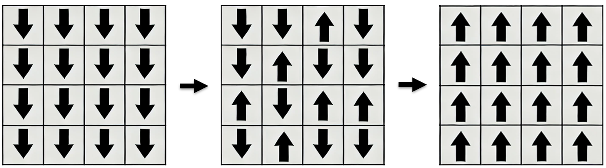
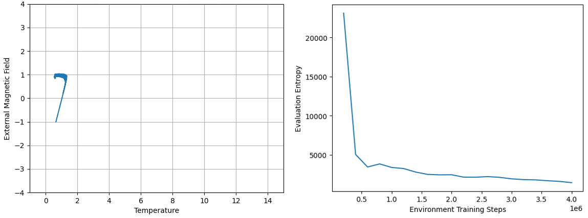

# Reinforcement Learning on Ising System

This repository contains the implmentation of a comparison of Proximal Policy Optimization (PPO) from Reinforcement Learning (RL) and Neuroevolution of Augmented Technologies (NEAT) from gradient-free evolutionary optimization on magnetization reversal of the Ising system. This provides a theoretical framework for energy consumption reduction in control of nanoscale magnetic systems, which is crucial for data storage technologies.

## Ising System
The Ising system is described by a 2D lattice structure where the objective is to flip the signs of the spins and minimize the entropy while satisfying temperature and magnetic field constraints. Below is a visual example of how this works.

*Visualization of magnetization reversal in the Ising system where the signs are flipped*

## Proximal Policy Optimization

*Left: Magnetic field vs temperature, Right: Entropy vs training steps.*

Although PPO successfully flips the spins while keeping the initial and final temperatures equal, the resulting entropy is ~2400, which is much higher than the supposed minimum of ~100 found by alternative methods. We reason that there is learning to an extent, given that the naive approach to flipping signs will yield an entropy of ~4000 instead. However, this signifies that other methods should be investgiated.

## Neuroevolution of Augmented Technologies

