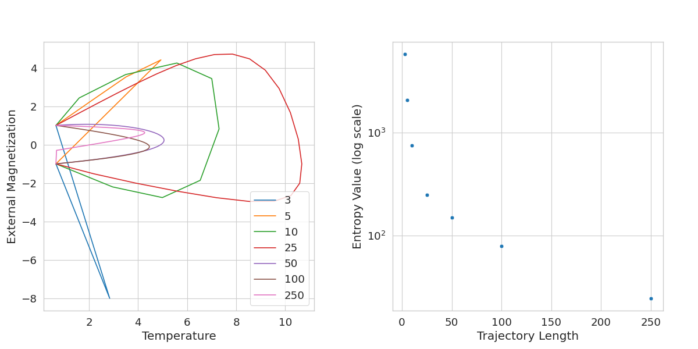

# Reinforcement Learning on Ising System

This repository contains the implmentation of a comparison of Proximal Policy Optimization (PPO) from Reinforcement Learning (RL) and Neuroevolution of Augmented Technologies (NEAT) from gradient-free evolutionary optimization on magnetization reversal of the Ising system. This provides a theoretical framework for energy consumption reduction in control of nanoscale magnetic systems, which is crucial for data storage technologies. The following is a summary of the work; more information can be found in [manuscript.pdf](manuscript.pdf).

## Ising System
The Ising system is described by a 2D lattice structure where the objective is to flip the signs of the spins and minimize the entropy while satisfying temperature and magnetic field constraints. Below is a visual example of how this works.

*Visualization of magnetization reversal in the Ising system where the signs are flipped.*

## Proximal Policy Optimization

*Left: Magnetic field vs temperature, Right: Entropy vs training steps via PPO.*

Although PPO successfully flips the spins while keeping the initial and final temperatures equal, the resulting entropy is ~2400, which is much higher than the supposed minimum of ~100 found by alternative methods. We reason that there is learning to an extent, given that the naive approach to flipping signs will yield an entropy of ~4000 instead. However, this signifies that other methods should be investgiated.

## Neuroevolution of Augmented Technologies
NEAT is a genetic algorithm that evolves the weights but also architecture of deep neural networks (DNNs). This is a sharp contrast compared to RL methods since it initializes with a small network and incorporates selective breeding, mutations, and growth for more complexity.

*Left: Magnetic field vs temperature, Right: Entropy vs trajectory length via NEAT for variable control trajectory lengths.*

We note that longer control trajectories lead to more controlled evolutions, which can be seen with more stable changes in magnetic field and temperature. This subsequently also reduces the entropy of the magnetic reversal process, however it is highly sample inefficient due to it being an evolutionary algorithm.
